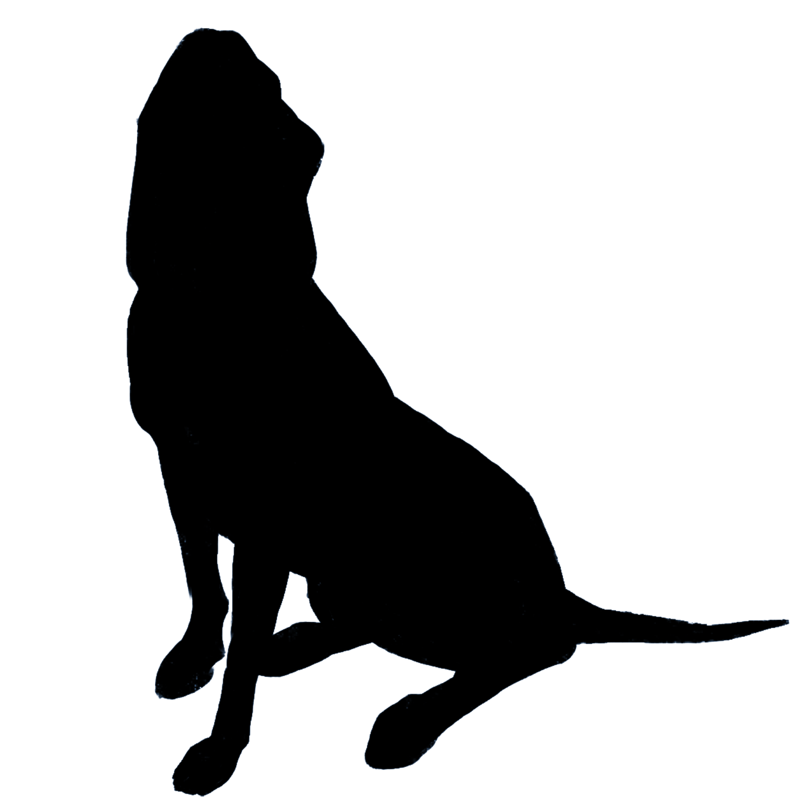

# Blood Hound
### [Github Project Link](https://github.com/freeopenapps/bh/projects/1)
- Track Ketones, Glucose, Weight, Blood Pressure
- Add custom note to each entry
- Backup and restore your data easily
- Add picture to each Entry, a meal for example (v2)
- See Graphs of your numbers to spot trends (v3)
- All data on your device, no ads or external network calls
- Free forever

# Specifications
- Android
  - Build: flutter build apk --split-per-abi
  - Install: flutter install
- No Web due to SQflite dependency

 
